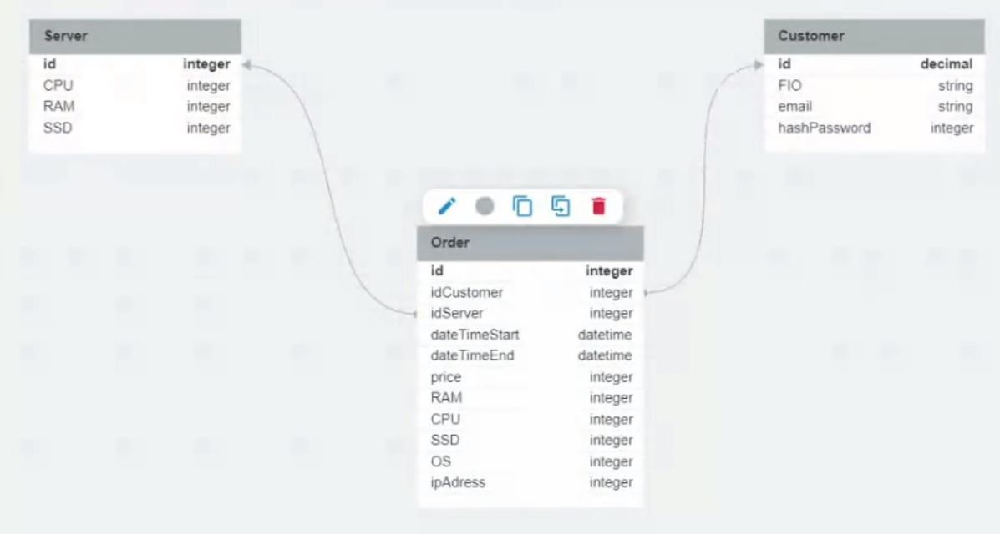
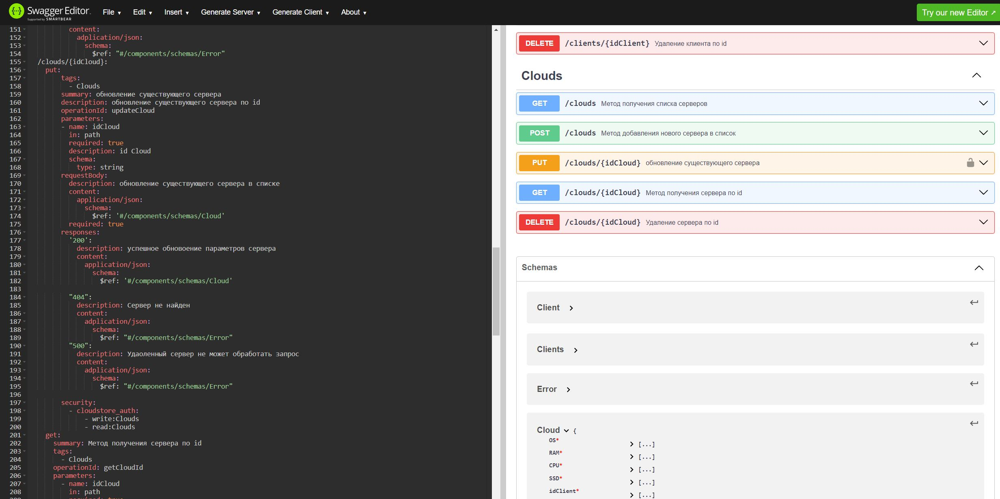

HomeWork 9 . 

Разработать полную ERD домена в https://www.dbdesigner.net/.
Дополнить swagger ответами домена (cloud) и смоделировать ошибки REST «400, 500» типов.Так же добавить PUT запрос
Имплементировать сгенерированный swagger код в приложения студента(через репозиторий).

